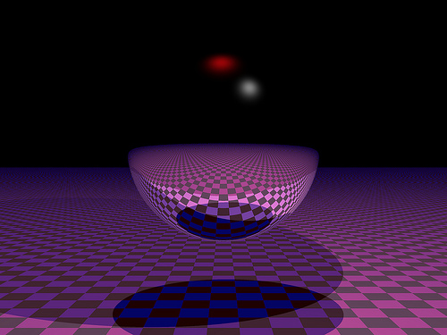
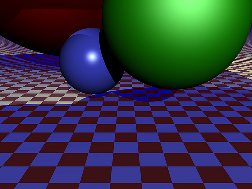
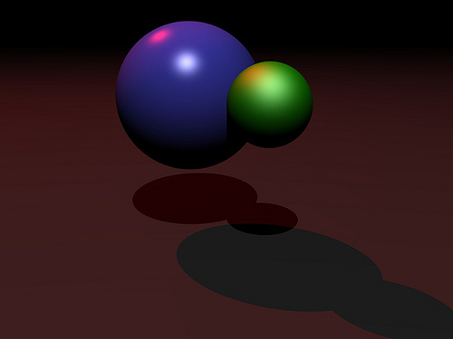

hairy-tracer
============

A raytracer in Python that's really slow

I wrote this in 2010 for a class in Computer Graphics. Quick and dirty are the words that come to mind.

Bear in mind the following:
1. Don't expect it to work. (Although I'm pretty sure it does work.)
2. It's pretty slow.
3. It definitely needs a lot of work.

Here are some sample renders:

I put this online as a starting point to start working on it again. And just maybe, someone out there 
might be interested in working on it too.

- 9 October 2014
