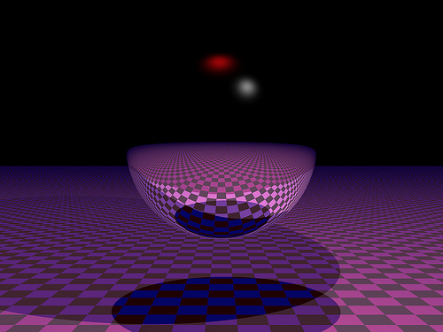
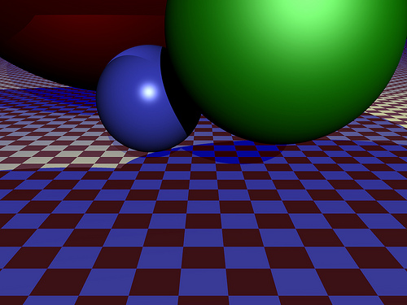
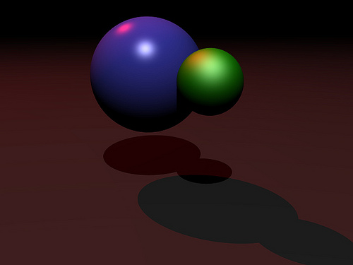

hairy-tracer
============

A raytracer in Python that used to be really slow. It's not so slow anymore.

I wrote this in 2010 for a class in Computer Graphics. Quick and dirty are the words that come to mind.

Bear in mind the following:

1. While it's not cutting edge, it mostly works.
2. It's not so slow anymore.
3. It definitely needs a lot of work, although finally got around to start working on this again (in 2026).

Here are some sample renders:

I put this online as a starting point to start working on it again. And just maybe, someone out there 
might be interested in working on it too.

- 9 October 2014
- Updated 22 August 2026
